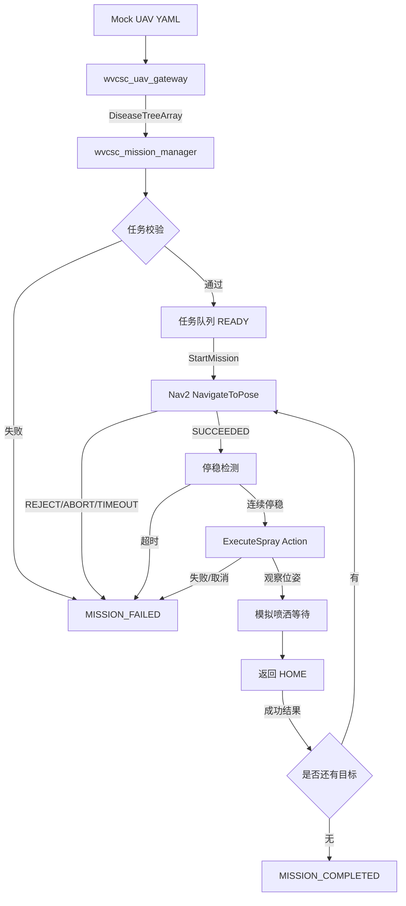
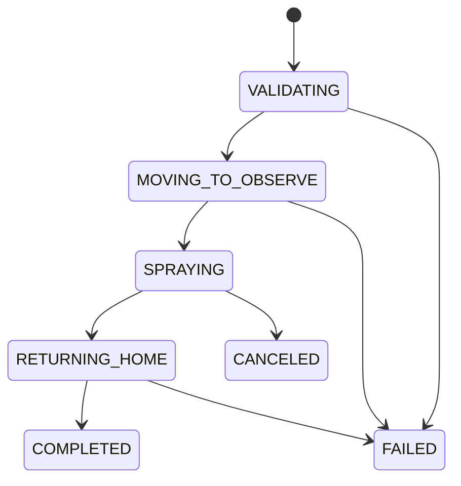
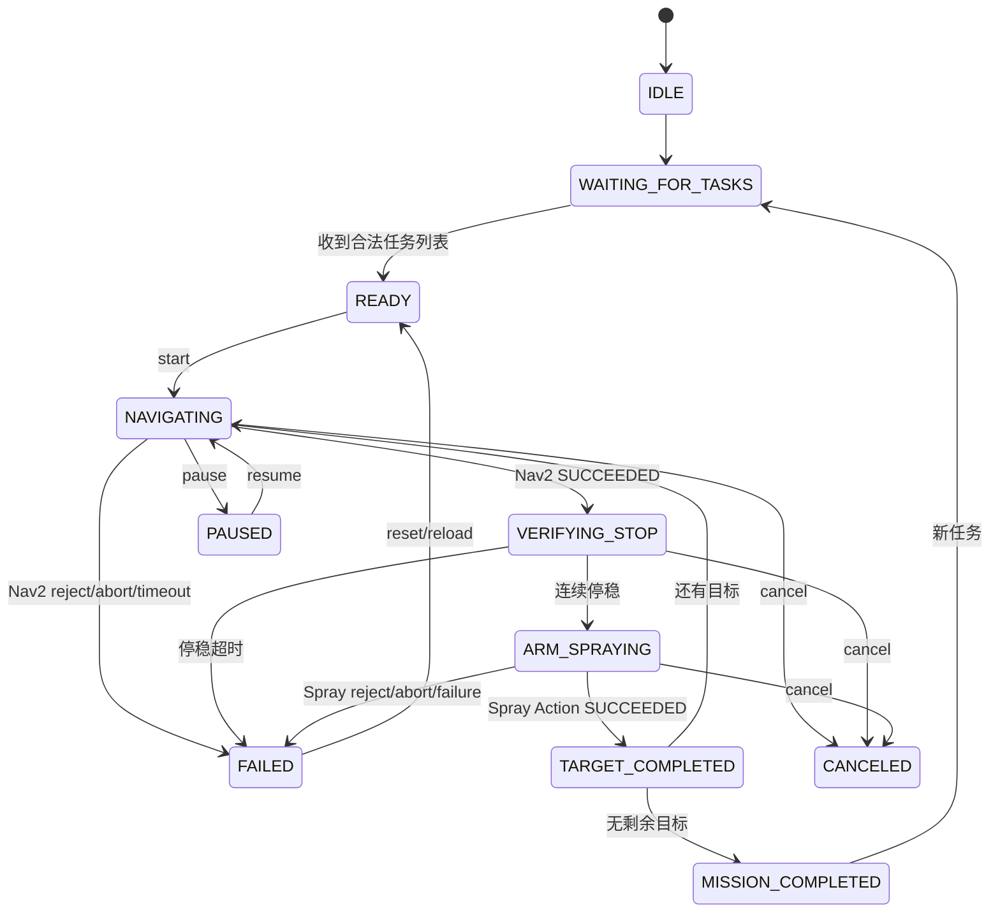

# WVCSC_S2Z_UTB_ARM：无人机坐标回传—小车自动导航—Alicia-M 模拟喷洒任务闭环实施方案

> 文档用途：提交给 Codex 进行代码审计、实现评估、分阶段修改、测试与验收  
> 项目工作区：`/home/robot/WVCSC_S2Z_UTB_ARM`  
> 目标环境：Ubuntu 22.04 + ROS 2 Humble + Gazebo Classic + Nav2 + MoveIt2  
> 编制日期：2026-07-14  
> 当前阶段：统一复合机器人仿真已经具备基础，小车导航与机械臂喷洒任务尚未通过统一任务管理器完整串联

---

## 0. 给 Codex 的执行要求

在修改任何代码前，必须先完成代码审计，不得仅依据本文档中的规划描述假设功能已经存在。

### 0.1 必须遵守

1. 先检查当前工作区的真实目录、Git 状态、已存在包、节点、接口和 Launch 文件。
2. 不得直接大规模修改 `src/Alicia-M-ROS2` 上游仓库。
3. 不得修改官方 `pymoveit2` 源码；项目适配逻辑保留在 `wvcsc_*` 包中。
4. 不得破坏当前已经能够运行的：
   - `wvcsc_simulation/launch/system_sim.launch.py`
   - Alicia-M MoveIt2 仿真
   - `trajectory_retime_server`
   - `wvcsc_arm_task` 的 stop/reset/resume 语义
5. 每完成一个阶段必须构建、测试、记录结果，再进入下一阶段。
6. 不允许通过在任务管理器中直接硬编码 Nav2 目标来绕过无人机接口。
7. 任务管理器不得直接发布机械臂关节轨迹，不得直接调用底层串口，不得直接控制 `/cmd_vel`。
8. 导航成功不等于可以立即喷洒，必须增加小车停稳确认。
9. 当前任何子任务失败后，默认采用 **fail-fast**：停止后续目标，不得误触发下一棵树。
10. 所有新参数必须进入 YAML 或 ROS 参数，不得散落为无说明的魔法数字。

### 0.2 执行前审计命令

```bash
cd /home/robot/WVCSC_S2Z_UTB_ARM

git status --short
find src -maxdepth 2 -name package.xml -print | sort
colcon list | sort

find src -maxdepth 4 -type f \
  \( -name "*.launch.py" -o -name "*.py" -o -name "*.yaml" \
     -o -name "*.xacro" -o -name "*.msg" -o -name "*.srv" \
     -o -name "*.action" \) | sort

rg -n "execute_spray|NavigateToPose|wvcsc_mission|disease_tree|world.*odom|map.*odom|AckermannSim|trajectory_execution_event" src
```

审计后先输出：

- 当前实际存在的 `wvcsc_*` 包；
- `wvcsc_arm_task` 的真实接口；
- `system_sim.launch.py` 的真实启动顺序；
- 当前 TF 发布者；
- 当前 Nav2 参数和地图文件；
- 当前测试是否能通过；
- 本文档中与当前源码不一致的地方。

---

# 1. 当前工程基线与专业判断

## 1.1 已经具备的基础能力

根据当前项目分析文档，工作区已经具备以下关键基础：

| 能力 | 当前状态 | 对明日闭环的意义 |
|---|---|---|
| 小车、机械臂统一 XACRO | 已完成基础合并 | 可以在同一 Gazebo 世界中验证整车与机械臂 |
| `wvcsc_simulation` 顶层启动 | 已具备可运行基线 | 已能编排 Gazebo、MoveIt2、控制器、Nav2 和 RViz |
| `AckermannSim` | 已实现 | 可接收 `/cmd_vel`，发布 `/odom` 和 TF |
| Alicia-M MoveIt2 | 已验证基础规划执行 | 可以完成观察位姿、模拟喷洒和 HOME |
| 轨迹重定时与非法轨迹阻断 | 已实现 | 可继续作为机械臂安全执行链 |
| stop/reset/resume | 已验证 | 任务管理器必须尊重其锁定语义 |
| `/arm/execute_spray` | 已有 Trigger 过渡接口 | 能触发动作，但缺少可等待的最终结果 |
| Nav2 | 已有工作基础 | 尚缺任务 Action 端到端、停稳互锁和多目标管理 |

当前按比赛完整闭环衡量约为 **40%～45%**。明日最重要的工作不是继续扩展底层算法，而是建立稳定的上层任务编排闭环。

## 1.2 明日最核心的工程目标

在统一 Gazebo 仿真中完成：

```text
Mock 无人机发布完整病树任务列表
        ↓
任务管理器接收、校验、排队
        ↓
调用 Nav2 NavigateToPose
        ↓
小车到达并持续停稳
        ↓
调用 Alicia-M ExecuteSpray Action
        ↓
机械臂执行观察位姿 → 模拟喷洒 → HOME
        ↓
任务管理器收到明确成功结果
        ↓
执行下一目标或结束任务
```

目标不是“节点都能分别启动”，而是：

> 同一个任务管理器能够控制整个时序，正确等待每一步结果，并在异常时停止后续动作。

## 1.3 明日不纳入范围

为避免任务扩张，明日不实现：

- 真实无人机飞控；
- 真实无人机视觉识别；
- Synria C10 RGB 相机；
- 单目测距和视觉伺服；
- 真实水泵、继电器和电磁阀；
- Web 前端；
- Alicia-M 实机串口稳定性；
- 复杂恢复树、动态任务重排；
- MPC、GraspNet、LLM、Autoware 集成；
- 多无人机、多小车调度。

这些功能后续通过统一接口替换，不应影响明日 Mock 仿真闭环。

---

# 2. 明日交付物和验收定义

## 2.1 必须交付的软件包

建议新增：

```text
src/
├── wvcsc_interfaces/
├── wvcsc_uav_gateway/
└── wvcsc_mission_manager/
```

修改：

```text
src/
├── wvcsc_arm_task/
└── wvcsc_simulation/
```

如包已经存在，应在原包基础上补充，不得重复创建同名包。

## 2.2 必须交付的 ROS 2 能力

1. `/uav/disease_trees`：发布完整病树任务列表。
2. `/mission/start`：开始执行当前 READY 任务。
3. `/mission/pause`、`/mission/resume`、`/mission/cancel`：最小任务控制接口。
4. `/mission/status`：持续发布任务状态。
5. `NavigateToPose` Action Client：控制小车导航。
6. `ExecuteSpray` Action Server：机械臂喷洒动作具备可等待结果。
7. 停稳检测：Nav2 成功后，确认 `/odom` 速度持续低于阈值。
8. 单目标和双目标顺序执行。
9. 失败时停止后续目标。
10. 一键 Launch：能够启动完整仿真闭环。

## 2.3 Definition of Done

只有同时满足以下条件才算明日任务完成：

- [ ] `colcon build` 成功；
- [ ] 原有 `wvcsc_arm_task` 测试继续通过；
- [ ] 新增接口可用 `ros2 interface show` 查看；
- [ ] Mock 节点发布 2 个目标；
- [ ] 任务管理器能收到并进入 READY；
- [ ] 启动任务后 Nav2 Goal 被接受；
- [ ] 小车到达第一个导航位姿；
- [ ] 小车速度连续至少 1 秒低于阈值；
- [ ] 机械臂 Action 被接受；
- [ ] 机械臂完成观察、等待和 HOME；
- [ ] 任务管理器收到 Action 最终成功结果；
- [ ] 第二个目标能够按相同流程执行；
- [ ] 任一步失败时不执行下一个目标；
- [ ] 完整流程连续运行至少 3 次；
- [ ] 产生运行日志和验收记录。

---

# 3. 总体软件架构



## 3.1 控制职责

| 模块 | 负责 | 不负责 |
|---|---|---|
| `wvcsc_uav_gateway` | 模拟无人机任务数据、消息质量、统一发布 | 不调用 Nav2，不控制机械臂 |
| `wvcsc_mission_manager` | 队列、状态机、Nav2、停稳互锁、机械臂 Action | 不直接发 `/cmd_vel`，不发关节轨迹 |
| `wvcsc_arm_task` | MoveIt2 动作序列、互斥、取消、结果 | 不决定导航目标，不管理整场任务 |
| Nav2 | 规划、控制、避障、到点 | 不触发机械臂 |
| `AckermannSim` | 仿真车辆运动学 | 不管理任务 |
| `wvcsc_simulation` | 启动和参数编排 | 不包含业务状态机代码 |

---

# 4. 坐标系与 TF 决策

## 4.1 统一 TF 责任

期望 TF：

```text
world
└── map
    └── odom
        └── base_footprint
            └── base_link
                └── arm_mount_link
                    └── alicia_base_link
                        └── ...
                            └── tool0
```

### 关键要求

- `map -> odom` 只能有一个发布者；
- `odom -> base_footprint` 只能由仿真里程计或真实 EKF 中的一个发布；
- `base_footprint -> base_link` 为固定关系；
- 机械臂根必须是 `alicia_base_link`，不能重新占用小车 `base_link`；
- 无人机最终提供给任务管理器的导航位姿必须固化到 `map`。

## 4.2 必须审计的潜在 TF 冲突

当前分析文档提到 `system_sim.launch.py` 发布静态 `world -> odom`，同时 Nav2/AMCL 可能发布 `map -> odom`。如果两者同时存在，`odom` 将出现两个父坐标系。

Codex 必须检查实际 TF 发布情况：

```bash
ros2 run tf2_tools view_frames
ros2 topic echo /tf_static --once
ros2 topic echo /tf --once
ros2 run tf2_ros tf2_echo map odom
ros2 run tf2_ros tf2_echo odom base_footprint
```

推荐逻辑：

- `use_nav2:=true`：
  - 发布 `world -> map` 静态单位变换；
  - AMCL 或定位节点发布 `map -> odom`；
  - `AckermannSim` 发布 `odom -> base_footprint`。
- `use_nav2:=false`：
  - 可发布 `world -> odom` 或 `map -> odom` 单位变换；
  - 不得与其他发布者重复。

不得通过忽略 TF 警告继续开发。

## 4.3 无人机坐标规则

明日 Mock 数据直接使用：

```yaml
header.frame_id: map
```

长期接口仍保留 `header.frame_id`，以便 Replay/Live 数据使用其他坐标系。任务管理器行为：

1. 检查 `frame_id` 非空；
2. 若为 `map`，直接使用；
3. 若不是 `map`，通过 TF2 转换；
4. 转换失败则拒绝该任务；
5. 不允许把小车移动后的相对坐标继续当作固定目标。

---

# 5. ROS 2 接口设计

## 5.1 `wvcsc_interfaces/msg/DiseaseTree.msg`

```text
string tree_id

# 识别置信度 [0, 1]
float32 confidence

# 病树在 header.frame_id 对应坐标系中的中心位置
geometry_msgs/Point tree_position

# 小车应到达的停靠位姿
geometry_msgs/Pose navigation_pose

# left / right
string spray_side

# 模拟或真实喷洒持续时间
float32 spray_duration
```

说明：

- `tree_position` 用于显示和后续视觉关联；
- `navigation_pose` 才是 Nav2 Goal；
- 不得把树中心直接作为小车导航目标；
- `spray_side` 只允许 `left` 或 `right`；
- `spray_duration` 需要限制范围。

## 5.2 `wvcsc_interfaces/msg/DiseaseTreeArray.msg`

```text
std_msgs/Header header

string mission_id

# mock / replay / live
string source_mode

DiseaseTree[] trees
```

建议 QoS：

- Reliability：Reliable；
- Durability：Transient Local；
- History：Keep Last；
- Depth：1。

这样任务管理器晚启动时仍可收到最后一份任务列表。

## 5.3 `wvcsc_interfaces/msg/MissionStatus.msg`

```text
uint8 IDLE=0
uint8 WAITING_FOR_TASKS=1
uint8 READY=2
uint8 NAVIGATING=3
uint8 VERIFYING_STOP=4
uint8 ARM_SPRAYING=5
uint8 TARGET_COMPLETED=6
uint8 RETURNING_HOME=7
uint8 PAUSED=8
uint8 MISSION_COMPLETED=9
uint8 CANCELED=10
uint8 FAILED=11
uint8 EMERGENCY_STOP=12

std_msgs/Header header
string mission_id
uint8 state
string state_text

string current_tree_id
uint32 current_index
uint32 total_targets
uint32 completed_targets

string last_error
bool nav_goal_active
bool arm_goal_active
```

任务状态必须由任务管理器统一发布，Web 后续只订阅该接口。

## 5.4 `wvcsc_interfaces/action/ExecuteSpray.action`

```text
# Goal
string tree_id
string spray_side
float32 spray_duration
---
# Result
bool success
uint16 error_code
string message
---
# Feedback
uint8 phase
float32 progress
string phase_text
```

建议错误码：

| error_code | 含义 |
|---:|---|
| 0 | 成功 |
| 1 | 参数非法 |
| 2 | 机械臂忙 |
| 3 | 系统被锁定 |
| 4 | 观察位姿规划失败 |
| 5 | 观察位姿执行失败 |
| 6 | 喷洒阶段取消 |
| 7 | HOME 规划失败 |
| 8 | HOME 执行失败 |
| 9 | 内部异常 |

反馈阶段建议：

```text
0 ACCEPTED
1 MOVING_TO_OBSERVE
2 SPRAYING
3 RETURNING_HOME
4 COMPLETED
5 FAILED
```

## 5.5 任务控制服务

明日采用标准接口降低实现量：

```text
/mission/start         std_srvs/srv/Trigger
/mission/pause         std_srvs/srv/Trigger
/mission/resume        std_srvs/srv/Trigger
/mission/cancel        std_srvs/srv/Trigger
/mission/skip_current  std_srvs/srv/Trigger   # 可选，默认关闭
```

行为约束：

- `start` 只能从 READY 进入 NAVIGATING；
- `pause` 必须取消当前 Nav2 Goal；机械臂运行中默认不允许普通暂停，应使用 cancel/stop；
- `resume` 从 PAUSED 重新执行当前目标；
- `cancel` 取消 Nav2 和机械臂 Goal，任务进入 CANCELED；
- `skip_current` 明日可实现但默认禁用，避免掩盖故障。

---

# 6. Mock 无人机网关设计

## 6.1 包结构

```text
wvcsc_uav_gateway/
├── package.xml
├── setup.py
├── setup.cfg
├── resource/wvcsc_uav_gateway
├── config/
│   └── mock_targets.yaml
├── launch/
│   └── mock_uav.launch.py
├── wvcsc_uav_gateway/
│   ├── __init__.py
│   ├── mock_uav_gateway.py
│   └── validation.py
└── test/
    ├── test_mock_config.py
    └── test_validation.py
```

## 6.2 Mock YAML 示例

仿真世界中树位于 `(3, 2)` 和 `(5, -2)`。导航位姿不能与树中心重合，建议初始值如下，必须通过 RViz 和 costmap 实际验证后再冻结：

```yaml
mission:
  mission_id: orchard_demo_001
  source_mode: mock
  frame_id: map
  publish_delay_sec: 8.0

  targets:
    - tree_id: tree_01
      confidence: 0.96
      tree_position:
        x: 3.0
        y: 2.0
        z: 0.0
      navigation_pose:
        x: 3.0
        y: 0.8
        yaw: 1.57079632679
      spray_side: left
      spray_duration: 2.0

    - tree_id: tree_02
      confidence: 0.94
      tree_position:
        x: 5.0
        y: -2.0
        z: 0.0
      navigation_pose:
        x: 5.0
        y: -0.8
        yaw: -1.57079632679
      spray_side: right
      spray_duration: 2.0
```

注意：

- 以上停靠点是初始建议，不是最终真值；
- 必须检查机器人 footprint、墙体、树模型和 costmap；
- Ackermann 小车需要足够的转弯空间；
- 若当前 Nav2 无法原地转向，不应把最终 yaw 设为难以到达的方向。

## 6.3 参数

```yaml
mock_uav_gateway:
  ros__parameters:
    config_file: ""
    publish_once: true
    repeat_period_sec: 0.0
    confidence_threshold: 0.5
    min_spray_duration: 0.2
    max_spray_duration: 10.0
    allowed_frame_ids: ["map"]
    allowed_sides: ["left", "right"]
```

## 6.4 发布逻辑

1. 启动并加载 YAML；
2. 校验全部目标；
3. 等待 `publish_delay_sec`；
4. 组装 `DiseaseTreeArray`；
5. `header.stamp = now()`；
6. 使用 Transient Local QoS 发布一次；
7. 输出结构化日志；
8. 不自动调用 `/mission/start`，除非 `auto_start` 参数显式开启。

## 6.5 数据校验

必须拒绝：

- 空 `mission_id`；
- 空 `tree_id`；
- 重复 `tree_id`；
- 非有限数值 NaN/Inf；
- `confidence` 不在 `[0,1]`；
- 非法 `spray_side`；
- 喷洒时间越界；
- 坐标超出配置边界；
- 四元数未归一化或全零。

Yaw 转四元数使用 `tf_transformations`、`transforms3d` 或明确的数学函数，不得手写错误字段。

---

# 7. 机械臂喷洒接口升级

## 7.1 当前问题

当前 `/arm/execute_spray` 是 `std_srvs/Trigger`，并异步触发动作。服务返回“已接受”不能代表：

- 已到观察位姿；
- 已完成喷洒；
- 已回 HOME；
- 动作没有失败。

因此不能直接作为多目标任务的完成信号。

## 7.2 推荐修改

在 `wvcsc_arm_task` 中新增 `ExecuteSpray` Action Server：

```text
/arm/execute_spray_action
```

旧服务：

```text
/arm/execute_spray
```

可以暂时保留为兼容入口，但任务管理器只允许使用 Action。

## 7.3 Action 执行流程



### 详细要求

1. Goal 校验：
   - `spray_side in {left,right}`；
   - `spray_duration` 在允许范围；
   - 当前不 busy；
   - 运动系统未锁定。
2. 根据 `spray_side` 选择：
   - `OBSERVE_LEFT`；
   - `OBSERVE_RIGHT`。
3. 使用现有 MoveIt2 适配层执行；
4. 每个阶段发布 Feedback；
5. 模拟喷洒期间检查 cancel；
6. 无论喷洒成功还是失败，若安全允许都尝试回 HOME；
7. HOME 失败必须返回失败，不得宣称成功；
8. 设置 busy 和锁定状态时使用线程安全机制；
9. cancel 时调用现有 stop 链路；
10. 不允许同时处理两个 Goal。

## 7.4 并发模型

由于 MoveIt2 调用、Action 回调和 stop/reset 可能并行，建议：

- `ReentrantCallbackGroup`；
- `MultiThreadedExecutor`；
- 或单独工作线程执行动作序列；
- 使用 `threading.Lock` 保护 busy/locked/current_goal；
- 禁止在单线程回调中长时间 `time.sleep()` 阻塞所有服务和 Action。

模拟喷洒等待可使用可中断循环：

```python
deadline = monotonic() + spray_duration
while monotonic() < deadline:
    if goal_handle.is_cancel_requested:
        # cancel and cleanup
        break
    sleep(0.05)
```

## 7.5 保持现有安全链

必须保留：

```text
MoveIt2 plan
→ trajectory_retime_server
→ 合法性检查
→ execute
```

不得在重定时失败时直接执行原始笛卡尔轨迹。

---

# 8. 任务管理器设计

## 8.1 包结构

```text
wvcsc_mission_manager/
├── package.xml
├── setup.py
├── setup.cfg
├── resource/wvcsc_mission_manager
├── config/
│   └── mission_manager.yaml
├── launch/
│   └── mission_manager.launch.py
├── wvcsc_mission_manager/
│   ├── __init__.py
│   ├── mission_manager.py
│   ├── mission_model.py
│   ├── target_validator.py
│   ├── stop_detector.py
│   └── state_machine.py
└── test/
    ├── test_state_machine.py
    ├── test_target_validator.py
    └── test_stop_detector.py
```

## 8.2 依赖

`package.xml` 至少包括：

```text
rclpy
action_msgs
nav2_msgs
nav_msgs
geometry_msgs
std_srvs
tf2_ros
tf2_geometry_msgs
wvcsc_interfaces
```

如发布 RViz Marker，再增加：

```text
visualization_msgs
```

## 8.3 状态机



## 8.4 任务接收

收到 `/uav/disease_trees` 时：

1. 校验 `mission_id`；
2. 检查是否为重复任务；
3. 校验每个目标；
4. 转换坐标到 `map`；
5. 复制到内部不可变任务模型；
6. 状态为忙时：
   - 默认拒绝替换当前任务；
   - 记录日志；
7. 状态为空闲时：
   - 清空旧队列；
   - 加载新队列；
   - 发布 READY；
8. 不自动执行，除非参数 `auto_start=true`。

## 8.5 Nav2 Action Client

使用：

```text
nav2_msgs/action/NavigateToPose
```

主要逻辑：

1. 等待 Action Server；
2. 构造 `PoseStamped`：
   - `header.frame_id = "map"`；
   - `header.stamp = now()`；
3. 发送 Goal；
4. 处理 Goal 是否接受；
5. 保存 goal_handle；
6. 接收反馈并更新状态；
7. 等待最终状态；
8. 只有 `STATUS_SUCCEEDED` 才进入停稳检测；
9. Reject、Abort、Cancel、超时进入失败流程。

禁止：

- 使用阻塞式死循环等待 Action；
- 在回调线程中调用 `spin_until_future_complete` 导致死锁；
- 忽略 Goal 被拒绝；
- 只根据距离小于阈值判断 Action 成功。

## 8.6 小车停稳互锁

订阅：

```text
/odom
```

参数：

```yaml
stop_detector:
  odom_topic: /odom
  linear_speed_threshold: 0.03
  angular_speed_threshold: 0.03
  stable_duration_sec: 1.0
  timeout_sec: 5.0
```

满足：

```text
abs(linear.x) <= linear_speed_threshold
abs(angular.z) <= angular_speed_threshold
```

连续达到 `stable_duration_sec` 后才算停稳。

任一采样超过阈值，连续计时清零。

注意：

- 不使用“收到 Nav2 SUCCEEDED 后 sleep 2 秒”替代真实停稳检测；
- 需要检查 odom 时间戳是否持续更新；
- odom 超时也应判定失败。

## 8.7 喷洒 Action Client

1. 等待 `/arm/execute_spray_action`；
2. Goal 包含：
   - `tree_id`；
   - `spray_side`；
   - `spray_duration`；
3. Goal 被接受后状态为 ARM_SPRAYING；
4. Feedback 转发到日志和 MissionStatus；
5. 只有 Result `success=true` 且 Action status succeeded，才标记目标完成；
6. 失败时停止任务；
7. cancel 时取消 Action，并触发现有机械臂 stop。

## 8.8 多目标逻辑

目标索引从 0 开始：

```python
current_index = 0
completed_targets = 0
```

单个目标成功后：

```text
TARGET_COMPLETED
→ completed_targets += 1
→ current_index += 1
→ 如果还有目标，延迟 0.5～1.0 秒进入下一次 NAVIGATING
→ 否则 MISSION_COMPLETED
```

明日默认：

```yaml
failure_policy: fail_fast
nav_retry_count: 0
arm_retry_count: 0
return_to_home_pose: false
```

在单目标稳定后，可将 `nav_retry_count` 增加为 1，但首次实现不建议自动重试掩盖问题。

## 8.9 Pause、Resume、Cancel

### Pause

若处于 NAVIGATING：

1. 调用 Nav2 cancel；
2. 等待取消完成；
3. 记录当前目标；
4. 进入 PAUSED。

若处于 ARM_SPRAYING：

- 默认返回“当前阶段不支持普通暂停，请使用 cancel”；
- 不应冻结机械臂在不确定中间姿态。

### Resume

1. 仅允许从 PAUSED；
2. 重新发送当前目标的 Nav2 Goal；
3. 不从被取消的旧 Future 继续。

### Cancel

1. 取消 Nav2 Goal；
2. 取消 Spray Goal；
3. 发布机械臂 stop；
4. 清理 active handle；
5. 进入 CANCELED；
6. 不自动回到 READY，需重新加载或显式 reset。

---

# 9. 任务管理器参数

`wvcsc_mission_manager/config/mission_manager.yaml`：

```yaml
mission_manager:
  ros__parameters:
    disease_tree_topic: /uav/disease_trees
    mission_status_topic: /mission/status
    odom_topic: /odom

    nav_action_name: /navigate_to_pose
    spray_action_name: /arm/execute_spray_action

    map_frame: map
    base_frame: base_footprint

    auto_start: false
    failure_policy: fail_fast

    nav_server_wait_timeout_sec: 30.0
    nav_goal_timeout_sec: 120.0
    spray_server_wait_timeout_sec: 30.0
    spray_goal_timeout_sec: 60.0

    linear_stop_threshold: 0.03
    angular_stop_threshold: 0.03
    stop_stable_duration_sec: 1.0
    stop_verify_timeout_sec: 5.0
    odom_stale_timeout_sec: 1.0

    confidence_threshold: 0.50
    max_targets: 20
    max_abs_map_x: 50.0
    max_abs_map_y: 50.0

    nav_retry_count: 0
    arm_retry_count: 0
    inter_target_delay_sec: 0.8

    publish_markers: true
```

---

# 10. Launch 集成方案

## 10.1 修改原则

不要把所有逻辑直接写进 `system_sim.launch.py`。Launch 只负责：

- 声明参数；
- Include 子 Launch；
- 启动节点；
- 条件控制；
- 必要的启动延时和依赖。

业务逻辑必须在节点中。

## 10.2 新增参数

建议为 `wvcsc_simulation/launch/system_sim.launch.py` 增加：

```text
use_mock_uav:=true
use_mission_manager:=true
auto_start_mission:=false
mock_target_config:=<默认配置路径>
```

## 10.3 启动顺序

```text
Gazebo + robot_state_publisher
        ↓
spawn_entity
        ↓
控制器 + MoveIt2 + trajectory_retime_server + wvcsc_arm_task
        ↓
AckermannSim
        ↓
Nav2
        ↓
wvcsc_mission_manager
        ↓
wvcsc_uav_gateway
```

实际不应依赖固定长时间 sleep 保证功能正确。即使 Launch 有延迟：

- 任务管理器也必须主动等待 Nav2 Action Server；
- 任务管理器也必须主动等待 Spray Action Server；
- Mock 消息使用 Transient Local QoS，避免发布时序丢失。

## 10.4 推荐启动命令

```bash
ros2 launch wvcsc_simulation system_sim.launch.py \
  use_nav2:=true \
  use_rviz:=true \
  use_mock_uav:=true \
  use_mission_manager:=true \
  auto_start_mission:=false
```

Headless 回归：

```bash
ros2 launch wvcsc_simulation system_sim.launch.py \
  gui:=false \
  use_rviz:=false \
  use_nav2:=true \
  use_mock_uav:=true \
  use_mission_manager:=true \
  auto_start_mission:=true
```

---

# 11. 实现顺序

## 阶段 0：冻结基线

### 操作

```bash
cd /home/robot/WVCSC_S2Z_UTB_ARM
git status
git rev-parse --short HEAD
git -C src/Alicia-M-ROS2 rev-parse --short HEAD
```

构建现有基线：

```bash
source /opt/ros/humble/setup.bash

colcon build --symlink-install \
  --base-paths src src/Alicia-M-ROS2 \
  --packages-select \
    pymoveit2 \
    trajectory_retime_server \
    wvcsc_arm_task \
    alicia_m_descriptions \
    alicia_m_driver \
    alicia_m_moveit_config \
    alicia_m_bringup \
    wvcsc_description \
    wvcsc_simulation
```

测试：

```bash
colcon test \
  --packages-select wvcsc_arm_task trajectory_retime_server \
  --event-handlers console_direct+

colcon test-result --verbose
```

### Gate 0

- 原有构建成功；
- 原有测试通过；
- 机械臂仿真仍能执行喷洒 Trigger；
- 保存日志。

---

## 阶段 1：建立 `wvcsc_interfaces`

### 操作

创建 ament_cmake 接口包，加入：

```text
msg/DiseaseTree.msg
msg/DiseaseTreeArray.msg
msg/MissionStatus.msg
action/ExecuteSpray.action
```

配置：

- `rosidl_default_generators`；
- `geometry_msgs`；
- `std_msgs`；
- `action_msgs`；
- 导出 `rosidl_default_runtime`。

### Gate 1

```bash
colcon build --symlink-install --packages-select wvcsc_interfaces
source install/setup.bash

ros2 interface show wvcsc_interfaces/msg/DiseaseTree
ros2 interface show wvcsc_interfaces/msg/DiseaseTreeArray
ros2 interface show wvcsc_interfaces/msg/MissionStatus
ros2 interface show wvcsc_interfaces/action/ExecuteSpray
```

全部输出正确。

---

## 阶段 2：升级 `wvcsc_arm_task`

### 操作

1. 保留现有运动封装；
2. 新增 Action Server；
3. 复用左/右观察姿态；
4. 支持 cancel；
5. 返回明确 Result；
6. 旧 Trigger 保留兼容；
7. 增加单元测试。

### 必测场景

- left 成功；
- right 成功；
- 非法 side 被拒绝；
- duration 越界被拒绝；
- busy 时第二个 Goal 被拒绝；
- locked 时 Goal 被拒绝；
- cancel 能停止；
- HOME 失败返回失败；
- 原有 stop/reset/resume 测试继续通过。

### Gate 2

```bash
ros2 action list | grep execute_spray
ros2 action info /arm/execute_spray_action
```

手动 Action 测试：

```bash
ros2 action send_goal \
  /arm/execute_spray_action \
  wvcsc_interfaces/action/ExecuteSpray \
  "{tree_id: tree_test, spray_side: left, spray_duration: 2.0}" \
  --feedback
```

必须等待至最终 Result，不得只返回“accepted”。

---

## 阶段 3：实现 Mock UAV

### 操作

1. 创建包和 YAML；
2. 实现配置加载；
3. 实现校验；
4. 使用 Transient Local QoS；
5. 延时发布；
6. 输出日志；
7. 添加测试。

### Gate 3

```bash
ros2 launch wvcsc_uav_gateway mock_uav.launch.py
ros2 topic echo /uav/disease_trees
ros2 topic info /uav/disease_trees -v
```

验证：

- mission_id 正确；
- 2 个 tree；
- frame_id 为 map；
- navigation_pose 四元数正确；
- 重启订阅者后仍能收到最后消息。

---

## 阶段 4：实现 Mission Manager 单目标

### 操作

先只处理第一个目标：

1. 接收任务；
2. READY；
3. `/mission/start`；
4. 发送 Nav2 Goal；
5. 处理 Action 结果；
6. 停稳检测；
7. 发送 Spray Goal；
8. 等待 Result；
9. MISSION_COMPLETED。

### Gate 4

完整单目标连续执行 3 次。

必须记录：

- 任务接收时间；
- Nav2 Goal 发送时间；
- Nav2 结束状态；
- 停稳开始和完成时间；
- Spray Goal 发送时间；
- Spray Result；
- 总耗时；
- 最终状态。

---

## 阶段 5：扩展双目标

### 操作

1. 启用整个目标数组；
2. 第一目标成功后执行第二目标；
3. 每个目标使用独立 tree_id；
4. 发布完成数量；
5. 最终进入 MISSION_COMPLETED。

### Gate 5

连续 3 轮完成：

```text
tree_01 NAVIGATING
tree_01 ARM_SPRAYING
tree_01 COMPLETED
tree_02 NAVIGATING
tree_02 ARM_SPRAYING
tree_02 COMPLETED
MISSION_COMPLETED
```

---

## 阶段 6：异常注入

必须至少验证：

1. 非法 frame_id；
2. 非法坐标；
3. Nav2 Goal 被拒绝；
4. 导航超时；
5. odom 不更新；
6. 小车无法停稳；
7. Spray Action Server 不存在；
8. Spray Goal 被拒绝；
9. Spray 执行失败；
10. 执行中 cancel。

任何失败后：

- 当前状态明确；
- `last_error` 非空；
- 不执行下一目标；
- 活跃 Action 被取消；
- 不遗留 busy 状态。

---

# 12. 构建与运行命令

## 12.1 完整构建

```bash
cd /home/robot/WVCSC_S2Z_UTB_ARM
source /opt/ros/humble/setup.bash

colcon build --symlink-install \
  --base-paths src src/Alicia-M-ROS2 \
  --packages-select \
    wvcsc_interfaces \
    wvcsc_uav_gateway \
    wvcsc_mission_manager \
    pymoveit2 \
    trajectory_retime_server \
    wvcsc_arm_task \
    alicia_m_descriptions \
    alicia_m_driver \
    alicia_m_moveit_config \
    alicia_m_bringup \
    wvcsc_description \
    wvcsc_simulation
```

如构建图发生依赖变化，Codex 应使用 `colcon list` 和 `rosdep` 修正，而不是盲目扩大到整个工作区。

## 12.2 测试

```bash
source install/setup.bash

colcon test \
  --packages-select \
    wvcsc_interfaces \
    wvcsc_uav_gateway \
    wvcsc_mission_manager \
    wvcsc_arm_task \
    trajectory_retime_server \
  --event-handlers console_direct+

colcon test-result --verbose
```

## 12.3 启动

```bash
source /opt/ros/humble/setup.bash
source /home/robot/WVCSC_S2Z_UTB_ARM/install/setup.bash

ros2 launch wvcsc_simulation system_sim.launch.py \
  use_nav2:=true \
  use_rviz:=true \
  use_mock_uav:=true \
  use_mission_manager:=true \
  auto_start_mission:=false
```

## 12.4 状态检查

```bash
ros2 node list | sort
ros2 action list | sort
ros2 service list | sort

ros2 topic echo /uav/disease_trees
ros2 topic echo /mission/status
ros2 topic hz /odom
ros2 topic echo /cmd_vel

ros2 action info /navigate_to_pose
ros2 action info /arm/execute_spray_action

ros2 control list_controllers
```

## 12.5 开始任务

```bash
ros2 service call /mission/start std_srvs/srv/Trigger "{}"
```

暂停：

```bash
ros2 service call /mission/pause std_srvs/srv/Trigger "{}"
```

恢复：

```bash
ros2 service call /mission/resume std_srvs/srv/Trigger "{}"
```

取消：

```bash
ros2 service call /mission/cancel std_srvs/srv/Trigger "{}"
```

---

# 13. 日志规范

建议统一日志前缀：

```text
[UAV_GATEWAY]
[MISSION]
[NAV]
[STOP_CHECK]
[ARM]
[SAFETY]
```

示例：

```text
[UAV_GATEWAY] published mission=orchard_demo_001 targets=2 frame=map
[MISSION] accepted mission=orchard_demo_001 targets=2
[MISSION] state READY -> NAVIGATING tree=tree_01 index=0/2
[NAV] goal accepted tree=tree_01 pose=(3.0,0.8,1.57)
[NAV] succeeded tree=tree_01
[STOP_CHECK] stable 1.02s v=0.000 w=0.000
[MISSION] state VERIFYING_STOP -> ARM_SPRAYING tree=tree_01
[ARM] phase MOVING_TO_OBSERVE side=left
[ARM] phase SPRAYING duration=2.0
[ARM] phase RETURNING_HOME
[ARM] result success tree=tree_01
[MISSION] target completed tree=tree_01 completed=1/2
```

失败日志必须包含：

- mission_id；
- tree_id；
- 状态；
- Action status；
- 错误码；
- 错误原因；
- 是否已经取消其他 Goal。

---

# 14. RViz/Gazebo 可视化建议

明日最低要求：

- 能看到 orchard 世界；
- 能看到小车和 Alicia-M；
- 能看到 Nav2 路径；
- 能看到目标点。

可选新增 `/mission/markers`：

| Marker | 表示 |
|---|---|
| 红色圆柱/球 | 病树位置 |
| 蓝色箭头 | 小车导航位姿 |
| 绿色 | 已完成 |
| 黄色 | 当前执行 |
| 灰色 | 等待 |
| 红色叉号 | 失败 |

Marker 发布属于辅助功能，不能阻塞主闭环。

---

# 15. 关键风险及处理

## 15.1 TF 多发布者

**风险**：`world -> odom` 与 `map -> odom` 同时存在。  
**处理**：先审计 TF，再按 `world -> map -> odom` 收敛。

## 15.2 Nav2 与 AckermannSim 模型不完全一致

当前 `AckermannSim` 直接使用 `Twist.angular.z` 积分，不是严格的转向角模型。明日可继续用于任务编排验证，但需要记录：

- 它验证的是 Nav2—任务管理—机械臂时序；
- 不代表真实阿克曼底盘导航性能；
- 后续实车调试必须重新验证停靠距离和 yaw。

## 15.3 Nav2 Goal 虽成功但车辆仍有速度

通过 odom 连续停稳检测处理，禁止固定 sleep 替代。

## 15.4 Trigger 被误判为完成

必须改成 Action，任务管理器不使用旧 Trigger。

## 15.5 机械臂动作阻塞 ROS 回调

使用 MultiThreadedExecutor、独立工作线程或异步执行，必须保证 stop/cancel 仍能响应。

## 15.6 任务重复发布

使用 `mission_id` 幂等：

- 相同 mission_id 在 READY/执行中再次收到时忽略；
- 新 mission_id 在忙碌时拒绝；
- 完成后是否允许重复由参数控制。

## 15.7 目标点不可达

Mock navigation_pose 必须在 RViz 中验证，不得根据树坐标机械地偏移后直接批量执行。

## 15.8 机械臂运动与底盘运动重叠

只有停稳确认后才发 Spray Goal；机械臂执行期间任务管理器不得发送新的 Nav2 Goal。

## 15.9 原有包回归

新增接口和 Action 后必须继续运行原有 15 个 Python 测试和轨迹重定时测试。

---

# 16. Codex 应提交的结果

Codex 完成后必须输出以下内容，不只报告“代码已修改”。

## 16.1 代码变更清单

按文件列出：

```text
新增：
- src/wvcsc_interfaces/...
- src/wvcsc_uav_gateway/...
- src/wvcsc_mission_manager/...

修改：
- src/wvcsc_arm_task/...
- src/wvcsc_simulation/...
```

## 16.2 架构说明

说明：

- UAV 数据如何进入任务队列；
- 如何调用 Nav2；
- 如何判断停稳；
- 如何调用喷洒 Action；
- 如何处理取消；
- 如何避免并发；
- TF 由谁发布。

## 16.3 测试结果

提供真实命令和输出摘要：

```text
colcon build：通过/失败
colcon test：通过数量
单目标 3 次：成功次数
双目标 3 次：成功次数
异常注入：各项结果
```

## 16.4 未解决问题

必须诚实列出：

- 无法完成的接口；
- 环境依赖缺失；
- TF 或 Nav2 参数问题；
- 机械臂规划失败；
- 测试覆盖不足；
- 需要人工确认的停靠点。

---

# 17. 明日推荐时间安排

| 时间段 | 工作内容 | 退出条件 |
|---|---|---|
| 09:00–10:00 | 审计工作区、构建基线、检查 TF | 基线可复现 |
| 10:00–11:00 | 建立 `wvcsc_interfaces` | 接口可 show |
| 11:00–12:30 | `ExecuteSpray.action` | 手动 Action 成功 |
| 13:30–14:30 | Mock UAV | 任务列表可稳定接收 |
| 14:30–16:30 | Mission Manager 单目标 | 完成一次端到端 |
| 16:30–18:00 | 双目标与状态发布 | 顺序执行成功 |
| 19:00–20:00 | 异常注入、修复 | 失败不触发下一目标 |
| 20:00–21:00 | 连续 3 次验收与文档 | 形成验收记录 |

优先级：

```text
单目标稳定
> 明确动作完成语义
> 双目标
> 失败处理
> 可视化美化
```

若单目标未稳定，不得为了“看起来完成”继续堆叠多目标、Web 或视觉功能。

---

# 18. 最终验收表

| 编号 | 验收项 | 结果 | 证据 |
|---:|---|---|---|
| 1 | 基线构建通过 |  |  |
| 2 | 原有测试通过 |  |  |
| 3 | 新接口构建通过 |  |  |
| 4 | Mock UAV 发布 2 个目标 |  |  |
| 5 | Mission Manager 进入 READY |  |  |
| 6 | Nav2 Goal Accepted |  |  |
| 7 | 第一个目标导航成功 |  |  |
| 8 | 停稳互锁通过 |  |  |
| 9 | Spray Action Accepted |  |  |
| 10 | Alicia-M 返回 HOME |  |  |
| 11 | 第一个目标完成 |  |  |
| 12 | 第二个目标完成 |  |  |
| 13 | 最终状态 MISSION_COMPLETED |  |  |
| 14 | 导航失败时停止后续任务 |  |  |
| 15 | 喷洒失败时停止后续任务 |  |  |
| 16 | Cancel 可终止当前流程 |  |  |
| 17 | 完整流程连续运行 3 次 |  |  |
| 18 | TF 无重复父坐标系 |  |  |
| 19 | 无遗留活跃 Goal |  |  |
| 20 | 文档和运行命令已更新 |  |  |

---

# 19. 后续推进路线

明日闭环完成后，按以下顺序扩展：

1. 增加 Web 后端，只调用任务级服务；
2. 增加无人机 Replay 视频与任务事件；
3. 替换为真实无人机 Live 数据；
4. 接入 Alicia-M 实机；
5. 获取厂家关节速度、加速度和负载限制；
6. 接入 Synria C10 RGB 相机；
7. 完成相机内参和眼在手标定；
8. 增加 RGB 目标复核与视觉伺服；
9. 接入真实喷洒 IO；
10. 在比赛场地重新标定导航停靠位姿和机械臂动作模板；
11. 完成 20 次以上连续回归；
12. 最后再进行 Web 美化和演示包装。

---

# 20. 技术结论

当前项目底层能力已经足以进入系统集成阶段。明日最合理的目标不是继续开发更多算法，而是建立一个具备明确输入、明确状态、明确完成信号、明确安全互锁和明确失败处理的最小闭环。

实施时必须抓住四个核心点：

1. **无人机数据必须通过统一任务接口进入系统；**
2. **Nav2 成功后必须确认小车真实停稳；**
3. **机械臂喷洒必须由可等待的 Action 返回最终结果；**
4. **所有流程由任务管理器串联，任何失败都不得误执行下一目标。**

完成该闭环后，真实无人机、C10 RGB、机械臂实机、喷洒硬件和 Web 都可以按统一接口逐步替换，项目风险将明显下降。

---

# 21. 实际执行状态（2026-07-14）

## 21.1 结论

**依赖延后范围内的代码实现和 Fake 闭环已经完成；原文 Definition of Done 尚未全部完成。**

未完成部分均属于真实 Gazebo/Nav2/MoveIt2 联调和完整工作区构建。目前不能把 Fake Action 测试等同于真实小车与 Alicia-M 连续运行验收。

## 21.2 已确认的实施差异

后续批准的“依赖延后版”对本文早期设计做了以下收敛，当前源码以这些决策为准：

1. 无人机只发布病树坐标、置信度、侧别和喷洒时长；停靠位姿由任务管理器按参数生成。因此 `DiseaseTree.msg` 不包含 `navigation_pose`。
2. 正式 Action 为 `/arm/execute_spray`；兼容 Trigger 为 `/arm/execute_spray_legacy`。
3. 仿真固定使用 `world -> map -> odom -> base_footprint`，不启动 AMCL；`AckermannSim` 独占发布 `odom -> base_footprint`。
4. 增加 `/mission/reset`，终态任务显式 reset 后再接收新任务。
5. 当前不增加 Marker、自动重试、Web、视觉和真实硬件逻辑。

## 21.3 已完成代码

- 新增 `wvcsc_interfaces`、`wvcsc_uav_gateway`、`wvcsc_mission_manager`。
- `wvcsc_arm_task` 已提供互斥、可取消、最终结果可等待的 `ExecuteSpray` Action，并保持 stop/reset/resume 语义。
- 任务管理器已实现任务校验、重复过滤、Nav2 Action、连续停稳检测、喷洒 Action、多目标顺序执行、pause/resume/cancel/reset 和 fail-fast。
- Mock 网关使用 Reliable + Transient Local，一次发布两个目标；晚启动订阅者测试通过。
- 停靠规则、HOME/左右观察姿态、喷洒范围、超时和速度阈值均已参数化。
- `system_sim.launch.py` 已加入 Mock UAV、任务管理器和自动开始参数；Nav2 使用独立 `nav2_sim.yaml`。
- `AckermannSim` 已禁止原地旋转，并按轴距和最大转角限制角速度。

## 21.4 构建与测试证据

不依赖 CAN 的六个包独立构建：

```text
pymoveit2
trajectory_retime_server
wvcsc_interfaces
wvcsc_uav_gateway
wvcsc_mission_manager
wvcsc_arm_task

Summary: 6 packages finished [1min 12s]
```

`wvcsc_description` 与 `wvcsc_simulation` 也已在独立临时前缀中构建成功：

```text
Summary: 2 packages finished [1min 1s]
```

`system_sim.launch.py --show-args` 解析成功，新增的四个任务闭环参数均可见。

测试结果：

```text
Summary: 52 tests, 0 errors, 0 failures, 0 skipped
```

其中：

- `wvcsc_uav_gateway`：6 项，包括两目标持久发布和晚启动订阅者；
- `wvcsc_mission_manager`：18 项，包括连续三轮双目标 Fake Action 闭环；
- `wvcsc_arm_task`：25 项，包括原有回归、左右喷洒、非法参数、busy/locked、cancel 和 HOME 失败；
- `trajectory_retime_server`：2 项 GTest；`colcon` 另计 1 项 CTest 聚合记录；
- 接口包通过构建和四个 `ros2 interface show` 检查，不宣称独立运行时测试。

连续三轮 Fake 闭环每轮均按以下顺序完成：

```text
tree_01 -> Nav2 -> stop check -> spray
tree_02 -> Nav2 -> stop check -> spray
MISSION_COMPLETED
```

生成的导航目标为 `(3.0, 0.5)`、`(5.0, -0.5)`，三轮共 6 个 Nav2 Goal 和 6 个 Spray Goal，顺序正确。

## 21.5 最终验收状态

| 编号 | 验收项 | 当前结果 | 证据或阻塞 |
|---:|---|---|---|
| 1 | 基线完整构建通过 | 阻塞 | 两处 `libcontrolcan.so` 尚未上传 |
| 2 | 原有测试通过 | 通过 | `wvcsc_arm_task` 25/25，包含原有测试 |
| 3 | 新接口构建通过 | 通过 | 接口可由 `ros2 interface show` 查看 |
| 4 | Mock UAV 发布 2 个目标 | 通过 | Transient Local 晚订阅测试通过 |
| 5 | Mission Manager 进入 READY | 通过（Fake） | 运行时 Fake 闭环测试 |
| 6 | Nav2 Goal Accepted | 通过（Fake） | Fake Nav2 Action Server |
| 7 | 第一个目标导航成功 | 通过（Fake） | 三轮双目标闭环 |
| 8 | 停稳互锁通过 | 通过 | 1.0 秒连续停稳、复位、过期和超时单测 |
| 9 | Spray Action Accepted | 通过（Fake） | Fake Spray Action Server |
| 10 | Alicia-M 返回 HOME | 部分完成 | 动作序列单测通过，真实 MoveIt2/Gazebo 待验收 |
| 11 | 第一个目标完成 | 通过（Fake） | 三轮双目标闭环 |
| 12 | 第二个目标完成 | 通过（Fake） | 三轮双目标闭环 |
| 13 | 最终状态 MISSION_COMPLETED | 通过（Fake） | 三轮均完成 |
| 14 | 导航失败时停止后续任务 | 通过 | reject/abort/timeout/fail-fast 单测 |
| 15 | 喷洒失败时停止后续任务 | 通过 | reject/failure/timeout/fail-fast 单测 |
| 16 | Cancel 可终止当前流程 | 通过 | Nav2/Spray 取消和锁定语义单测 |
| 17 | 完整流程连续运行 3 次 | 部分完成 | Fake 3/3；真实 Gazebo 0/3 |
| 18 | TF 无重复父坐标系 | 部分完成 | Launch 已收敛；运行时 `view_frames` 待验收 |
| 19 | 无遗留活跃 Goal | 通过（Fake） | reset、cancel 和句柄收敛测试 |
| 20 | 文档和运行命令已更新 | 通过 | 本节记录实际状态 |

## 21.6 当前外部阻塞

1. 缺少：

   ```text
   src/can_bridge/lib/x86_64/libcontrolcan.so
   src/wtb_car_driver/lib/libcontrolcan.so
   ```

2. 本机 Nav2 lifecycle manager 当前还存在二进制依赖不一致：

   ```text
   libdiagnostic_updater.so => not found
   ros-humble-diagnostic-updater 4.0.6-1jammy.20251118.221111
   ros-humble-nav2-lifecycle-manager 1.1.20-1jammy.20260607.075955
   ```

3. 因上述阻塞，以下证据尚未产生：

   - 完整 `colcon build` 成功日志；
   - 真实 Gazebo 单目标 3/3 和双目标 3/3；
   - 真实 Alicia-M Action 返回 HOME；
   - 运行时 TF `view_frames`；
   - Nav2/MoveIt2 真实取消后无残留 Goal；
   - RViz 中停靠点和 costmap 可达性确认。

补齐 CAN 库并修复 ROS 二进制依赖后，应从本节未完成项继续验收，不需要重写任务管理、Mock 网关或 Action 接口。

---

# 22. 明日续执行清单（公司电脑）

## 22.1 开始前：保护本地改动并同步依赖

当前工作区存在未提交的方案、接口和任务闭环代码改动。先确认这些改动已经保存，再同步公司电脑上传的依赖；不要用 `git reset --hard` 或 `git checkout --` 覆盖本地代码。

```bash
cd /home/robot/WVCSC_S2Z_UTB_ARM
git status --short
git pull --ff-only
```

如果 `git pull --ff-only` 因本地改动中止，先保留当前文件内容，再按团队 Git 流程提交或暂存后重新同步。

## 22.2 Gate A：确认 CAN 动态库

```bash
cd /home/robot/WVCSC_S2Z_UTB_ARM

file src/can_bridge/lib/x86_64/libcontrolcan.so
file src/wtb_car_driver/lib/libcontrolcan.so
ldd src/can_bridge/lib/x86_64/libcontrolcan.so
git check-ignore -v src/can_bridge/lib/x86_64/libcontrolcan.so
git check-ignore -v src/wtb_car_driver/lib/libcontrolcan.so
```

通过条件：

- 两个 `file` 均能识别为当前机器可用的 ELF 共享库；
- `ldd` 没有 `not found`；
- `git check-ignore -v` 不应输出忽略规则。

如果仍有缺库，不创建空文件、伪造 `.so` 或修改 `can_bridge`/`wtb_car_driver` 的 CMake；回到公司依赖仓库检查上传路径和架构。

## 22.3 Gate B：修复 Nav2 系统依赖

```bash
source /opt/ros/humble/setup.bash
ldd /opt/ros/humble/lib/nav2_lifecycle_manager/lifecycle_manager | grep 'not found'
dpkg-query -W -f='${Package} ${Version}\n' \
  ros-humble-diagnostic-updater ros-humble-nav2-lifecycle-manager
```

本机已知错误是：

```text
libdiagnostic_updater.so => not found
```

由管理员修复 ROS 包版本后重新确认：

```bash
sudo apt update
sudo apt install --only-upgrade ros-humble-diagnostic-updater
ldd /opt/ros/humble/lib/nav2_lifecycle_manager/lifecycle_manager | grep 'not found'
```

最后一条命令无输出才进入真实 Nav2 联调。禁止用手工软链接掩盖 ABI/版本不一致。

## 22.4 Gate C：完整构建

```bash
cd /home/robot/WVCSC_S2Z_UTB_ARM
source /opt/ros/humble/setup.bash

colcon build --symlink-install \
  --base-paths src src/Alicia-M-ROS2 \
  --packages-select \
    wvcsc_interfaces \
    wvcsc_uav_gateway \
    wvcsc_mission_manager \
    pymoveit2 \
    trajectory_retime_server \
    wvcsc_arm_task \
    can_bridge \
    wtb_car_driver \
    alicia_m_descriptions \
    alicia_m_driver \
    alicia_m_moveit_config \
    alicia_m_bringup \
    wvcsc_description \
    wvcsc_simulation \
  --event-handlers console_cohesion+
```

通过条件：上述目标包全部 `Finished`，无 `Failed` 或 `Aborted`。

## 22.5 Gate D：测试和接口检查

```bash
source install/setup.bash

colcon test \
  --packages-select \
    wvcsc_interfaces \
    wvcsc_uav_gateway \
    wvcsc_mission_manager \
    wvcsc_arm_task \
    trajectory_retime_server \
  --event-handlers console_direct+

colcon test-result --verbose

ros2 interface show wvcsc_interfaces/msg/DiseaseTree
ros2 interface show wvcsc_interfaces/msg/DiseaseTreeArray
ros2 interface show wvcsc_interfaces/msg/MissionStatus
ros2 interface show wvcsc_interfaces/action/ExecuteSpray
```

当前无 CAN 阶段基线是 `52 tests, 0 errors, 0 failures, 0 skipped`。测试数减少或出现失败时，先保存完整日志，不要直接修改验收数字。

## 22.6 Gate E：真实 Gazebo 单轮闭环

先关闭 RViz，降低联调噪声：

```bash
source /opt/ros/humble/setup.bash
source /home/robot/WVCSC_S2Z_UTB_ARM/install/setup.bash

ros2 launch wvcsc_simulation system_sim.launch.py \
  gui:=false \
  use_rviz:=false \
  use_nav2:=true \
  use_mock_uav:=true \
  use_mission_manager:=true \
  auto_start_mission:=true
```

另开终端检查：

```bash
source /opt/ros/humble/setup.bash
source /home/robot/WVCSC_S2Z_UTB_ARM/install/setup.bash

ros2 node list | sort
ros2 action list | sort
ros2 topic echo /uav/disease_trees --once
ros2 topic echo /mission/status
ros2 action info /navigate_to_pose
ros2 action info /arm/execute_spray
ros2 run tf2_ros tf2_echo map odom
ros2 run tf2_ros tf2_echo odom base_footprint
```

单轮必须观察到：

```text
READY
-> NAVIGATING tree_01
-> VERIFYING_STOP
-> ARM_SPRAYING
-> tree_01 completed
-> NAVIGATING tree_02
-> VERIFYING_STOP
-> ARM_SPRAYING
-> tree_02 completed
-> MISSION_COMPLETED
```

同时确认机械臂日志包含观察位姿、`SPRAYING`、`RETURNING_HOME` 和 HOME 成功；只有 Fake 测试通过而真实 MoveIt2 未返回 HOME，不得勾选第 10 项。

## 22.7 Gate F：真实三轮回归和 TF 验收

完整启动命令连续执行 3 轮，每轮单独保存日志。每轮结束后正常退出，再启动下一轮；不要通过残留进程复用上一轮状态。

每轮记录：

- `mission_id`；
- 两个 Nav2 Goal 的接受和最终状态；
- 两次停稳检测，持续时间应为配置的 `1.0 s`；
- 两个 Spray Action 的最终 Result；
- 最终 `MISSION_COMPLETED`；
- 是否有 `FAILED`、残留 active Goal 或异常退出。

TF 检查：

```bash
ros2 run tf2_tools view_frames
```

验收树必须满足：

```text
world -> map -> odom -> base_footprint -> base_link
```

`odom` 只能有一个父节点 `map`；`base_footprint` 只能由 `odom` 连接；不得同时出现 `world -> odom` 或 AMCL 发布的第二条 `map -> odom`。

## 22.8 异常验收顺序

真实单轮成功后再做异常，不要在基础闭环未成功时同时改 Nav2 和任务管理器：

1. 停止或暂不启动 Nav2，确认任务进入失败且不发送 Spray Goal；
2. 让 `/odom` 不更新，确认停稳检测以 stale/timeout 失败；
3. 停止 Spray Action Server，确认导航后任务失败且不进入下一目标；
4. 运行中调用：

   ```bash
   ros2 service call /mission/cancel std_srvs/srv/Trigger "{}"
   ```

   确认状态为 `CANCELED`、Nav2/Spray Goal 均结束；
5. 调用 reset 后确认可以重新接收任务：

   ```bash
   ros2 service call /mission/reset std_srvs/srv/Trigger "{}"
   ```

## 22.9 明日完成定义

只有满足以下条件，才将本方案标记为“完整执行完成”：

- Gate A～F 全部通过；
- 真实 Gazebo 双目标闭环连续 3/3；
- 真实 Alicia-M 每次均回 HOME；
- 导航失败不触发机械臂；
- 喷洒失败不执行下一目标；
- cancel 后无残留 Goal；
- `view_frames` 无重复父节点；
- 将真实日志路径、成功次数和异常测试结果填回第 21.5 节。

在此之前，方案状态保持“代码/Fake 闭环完成，真实仿真验收未完成”。
